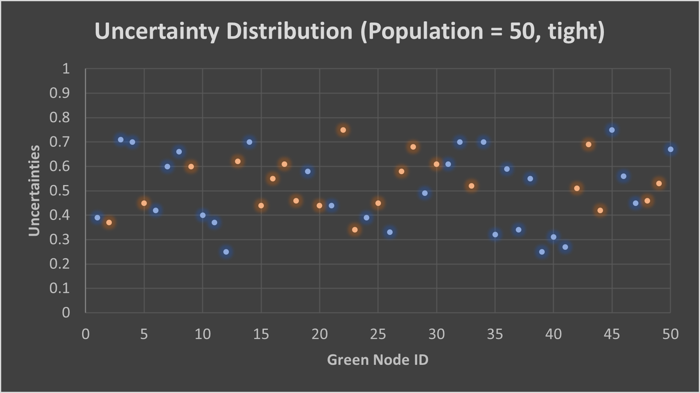
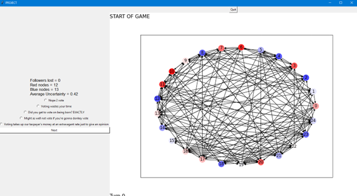

# Propaganda_Simulator
A simulator created for CITS3001 UWA unit with the intent of using reinforced learning algorithms and artificial intelligence
**CITS3001 Project**

**2022**

| **Name** | **StudentID** | **Degree** |
| Sunny Lac | 23119307 | Computer Science |
| **Name** | **StudentID** | **Degree** |
| Tony Nguyen | 23090585 | Computer science |

# Table of Contents

_**[Introduction](#introduction)**_

_**[Assumptions](#assumption)**_

_**[Selection and design of appropriate AI technology](#selection-and-design-of-appropriate-ai-technology)**_

**[Game Play](#game-play)**

_**[Implementation of the Agents](#implementation-of-the-agents)**_

_**[Agent Design](#agent-design)**_

**[Green Agents](#green-agents)**

**[Red and blue agents](#red-and-blue-agents)**

**[Grey Agents](#grey-agents)**

_**[Validation of Agents](#validation-of-agents)**_

_**[Performance of Agent when playing with a human](#performance-of-agent-when-playing-with-a-human)**_

_**[Visualisation](#visualisation)**_

#

#

# Introduction

The game is a strategic tug-of-war between a blue and red team of trying to obtain as many green followers as possible from a green team. Where blue team need to preserve energy to keep playing the game so that they may obtain as many followers as possible while red team is trying to prolong the game until blue runs out of energy while also not losing too many connections to followers. It's a strategic tug-of-war because blue wants as many green followers as possible to lose connection with red, so it needs to allow green followers to be on red side while also making sure that by the end of the game red doesn't have more followers than they do. Red however wants to pull green followers towards them while not over pulling and losing them. They both have to consider that green agents also interact with each other which will be more in a teams favour if they have more green agents on their side interacting with each other. As such letting a team take too many green agents can put you in a metaphoric poverty trap.

**Please note that throughout the report, you are allowed to add screenshots, graphs, equations and code snippets.**

# Assumptions

State all your assumptions, including but not limited to:

1. What is the interval of uncertainty in your project? What do-1,0,+1 represent?
2. How are you perceiving green nodes' opinion? Do you perceive it as vote/not vote in election, or are you perceiving it as vote for blue/vote for red?
3. Any other assumptions

The uncertainty interval is 0 – 1 with 1 representing high certainty and 0 representing low certainty.

Green nodes opinions are perceived as siding with either red or blue agenda, which in this case the red's agenda is to not vote while blue's agenda is to vote.

It is also assumed that interaction between green agents may not always be both ways, that is because green agents can be affecting each other through online public messages, acting as opinion leaders or posting content online. As such interaction may only be one way as opinions are not enforced both ways. The green agents that affect each other both ways are perceived as those who are interacting with each other directly, having a conversation/discussion/argument that will influence one another.

The assumption with green agent uncertainty is that those who are more certain towards their opinion will have a stronger effect on interaction with other green agents, 100% influence. However, those with weaker certainty towards their opinion will still have an effect although only half as effective, 50% influence.

A person siding with the blue team interacting with a blue team member will increase their certainty, while interacting with a red team member will decrease their certainty towards red and vice versa.

We assume that for red team to lose connection to followers, it would mean they are too potent with their message (certainty goes above 1), in which case it becomes too good to be true and they lose trust. However, we assume that there is only a chance of this happening, about 30% chance for red team to lose a follower due to this.

We assume that grey agents whether they be red spy or not, will always use the most potent message as there is no draw back due to no energy or follower loss.

We assume blue team only knows how many grey agents they have left to use, but don't know who or how many spies there are among the grey agents.

# Selection and design of appropriate AI technology

## Methodology

1. Describe and justify your methodology for this project, including
  1. which parameters are hard coded,
  2. which parameters are to be input at the start of the game and
  3. what type of methods you used to make your agents intelligent.

The number of green agents and their connection probability with other green agents will be inputted at the start of the game which will be used to construct an Erdos-Renyi directed graph. The grey agents are proportionally 10% of the green agent population.

Our methodology in order to make our agent smarter, reinforcing its intelligence, is by utilising all turn results to optimise expected returns from each potency use in each situation for both ai's (how much percentage of the green population is on their side). The utility value of each move will be the ratio of their gain to loss (Blue: green agents gained/energy used, Red: green agents gained/followers loss). This is done by simulating a round of round of green agents changing sides. We will continuously average out the expected result from each turn across a variety of games with various parameters so that the value of using a potency in a particular situation will be the universally optimal move. This ai knowledge data will be saved in a text file. For blue this also includes estimating the use of a grey agent which they assume will use the max potency at a ratio of no energy loss.

## Game Play

1. Explain in detail how the game is played?
2. How turns are organised?
3. How opinions and uncertainties are updated?
4.

The game start:

- Input parameter
- Select team (Blue or red)

The game is played in order of Red, Blue then green

Red Turn: Red picks from 10 options, each of which is a message with a potency associated to it which will affect all green agents in the environment using the equation below.

Blue Turn: Blue picks from 11 options, one of which is the use of grey agents, the other 10 is messages which all have a potency associated with that will affect all green agents in the environment using the equation below.

Grey Turn:

Grey agents will use the max potency for blue team and affect all green agents this will not make blue team lose any energy.

If the grey agent is a red spy it will act the same and use the max potency but for the red team. Additionally, this will not make red team lose any followers

Blue and red Team uncertainty equation:

If green agent on same siding (opinion towards the team):

New\_uncertainty = previous\_uncertainty x (1 + uncertainty\_of\_team)

Otherwise, on different teams:

New\_uncertainty = previous\_uncertainty x (1-uncertainty\_of\_team)

Green Turn: During this turn, all green agents will affect all other green agents it is connected to in a directed manner, so there will be cases where green agents affect on another is one way and cases where its both ways using the equation below. In the case 2 green agents affect each other, they will affect each other simultaneously. Their effectiveness in influence is also dictated by their certainty compared to who they're interacting with. They affect each other by

Effectiveness of influence:

- 100% (1), if the interacting agent has a higher certainty compared to the one they're interacting with.
- 50% (2), if the interacting agent has a lower certainty compared to the one they're interacting with.

Green interaction uncertainty:

If both green agent on same side:

New\_uncertainty = previous\_uncertainty x ((1 + uncertainty\_of\_other\_agent)/effectiveness\_of\_influence)

Otherwise, if they're on opposing sides:

New\_uncertainty = previous\_uncertainty x (1-uncertainty\_of\_other\_agent)/ effectiveness\_of\_influence

After the green turn, there is also a process for agents deciding to switch sides. Chance of an agent switching side is proportional to their uncertainty.

e.g. A green agent on red side with a certainty of 30%, means there is a 70% chance for them to switch sides.

The game will check the results to see if the game has ended:

The end state is either:

1. When blue agents has lost all energy and grey agents and red has more followers (Red won)
2. When blue agents has lost all energy and grey agents, red has no more connections to green agents and blue has more followers (blue won)
3. When all green agents are either red or blue (red/blue won)

# Implementation of the Agents

1. State main points about the implementation of agents. This heading is more focused on the code and how you made it efficient.

The agents and their data are saved in a global variable which can be accessed from all the functions when required.

For green agents, we saved it in an array of objects that can be iterated through and modified as the game continues with new data displayed on the graph by redrawing the modified world.

Blue agents contains data on their energy level and the potency of their messages as well as a method to grab their energy and to reduce their energy.

Red agents contains data on the potency of their messages.

Green agents contains data on their uncertainty, a list of who they have connections to as well as their siding and if they have lost connection to red.

1. How long the program takes to run a single turn with variable number of green agents. Report for both small and large number of green agents.

Connection probability set at 25%

Time to initialise environment of green agents (ga):

20 ga: 0.32 s

50 ga: 1.02 s

100 ga: 3.58 s

500 ga: 86.23 s

Time to do redTurn:

20 ga: 0.18s

50 ga: 0.82s

100 ga: 3.42s

Time to do blueTurn:

20 ga: 0.18s

50 ga: 0.84s

100 ga: 3.56s

Time to do green Turn:

20 ga: 0.17s

50 ga: 0.82s

100 ga: 3.56s

1. Which programming language you used? Whether you followed an Object Oriented approach or not.

We used an object oriented approach, with each agent being an object. We created 4 classes, one for red, blue, green and grey.

1. Which libraries you have used?

Libraries we used:

  - Networkx
  - Matplotlib
  - Tkinter
  - Random
  - Copy
  - ast

## Running the game

How can a layman run your game? Provide the commands, and associated parameters needed with an example workflow of the game.

To run the game, the person simply needs to start the main file and from there a GUI will pop-up that will provide all the necessary parameters inputted as buttons and scrollers.

From there, the user will be required to select either they want to simulate a game between AI's or the user wants to vs against an AI.

The user will have to use the scroller to select the number of green agents for the game and use another scroller to select the connection probability of green agents to other green agents. The number of green agents is capped at a minimum of 3 as any less would be redundant.

There is also 2 scrollers to control the upper and lower bounds of the green agents uncertainty values.

If the user selected 'Player vs AI', an additional drop-down menu will pop-up that will allow the user to pick what team they want to play as or have it as random.

Once the user has selected a gamemode and are satisfied with the parameters, they may press the 'press' button to initiate the simulation/game.

In the AI vs AI gamemode, the game will automatically be played by the ai and displayed till a team has won. Each turn number will be displayed as well as whose turn it is and what option they picked.

In the Player vs AI game mode, the user will be given options based on what team they are

In Red team:

- They have access to how many connections to followers they have lost
- Red-centric messages

In blue team:

- Has access to how much energy they have left
- Blue-centric message
- An additional option of blue agents

 When blue does not have enough energy or grey agents for the respective option, it will disappear and not be available to the user.

The graph displayed is the result of the previous turn.

When the game has ended/a team has won, the game will display appropriately:

# Agent Design

This heading focuses on the architectural design of the agents in the game

e.g.,

## Green Agents

1. Are you using a static network or a dynamic network?

Dynamic

1. Can we generate a network when the game start?

Yes, you're able to generate the number of green agents and their probability of having connections with other green agents

1. What type of underlying network model you are using?

Erdos-Renyi

1. Other properties of the network, e.g., is it weighed, can links be added or removed during the play?

Directed, not weighted

Links cannot be added or removed during the play

1.

## Red and blue agents

1. Describe your design of the message potency (a.k.a. uncertainty of red and blue nodes. )

[0.1, 0.2, 0.3, 0.5, 0.75] will be the respective 5 different message potency, each will affect green agents by that percentage where 0.2 represents 20%.

1. Describe your method for changing the followers' number in case of red agent.

The followers number will be changed after green has done their turn. The process of a green agent to change teams is based on their certainty, a 90% certainty value (0.9) would mean that the green agent only has a 10% chance to change teams, whereas a certainty of 10% means there's a 90% chance to change teams.

In case of a green agent on red side that has lost connection with red team, they may still change to red followers if their certainty with blue is low enough which can still be affected by green's turn where it'll be influenced by other green agents. However, they can't be affected directly by red agents.

1. Describe your method for changing the energy level of blue nodes (a.k.a. lifeline)

Blue has starting energy of 25.

[1, 2, 3, 4 ,5] is the energy use correlating with each potent message index respectively. E.g. using a message with potency 0.75 would require 5 energy.

1. Other Pertinent points regarding the working of your agent

## Grey Agents

Describe the working of the grey agents.

The number of grey agents available in a game is 10% of the population at a minimum of 1 grey agent each game.

The grey agent will use the potency selected by the blue agent on all green agents in the environment but won't decrease blue agents energy level.

If it's a bad grey agent aka a red agent, it'll act like a red agent ai but use the potency selected by blue on all green agents in the environment, but not allowing any green followers to be loss due to this by keeping the max certainty at 1.

# Validation of Agents

1. Report any tests you conducted to ensure the agents are doing the task they have been asked to do.

We used a set environment and controlled variables (green agent population and their individual uncertainties) to test expected outputs based on the turn and the equation based on the potency.

E.g. a green agent with:

- uncertainty 0.2

- Siding with Red

During Red turn (using 0.1 potency) expected: uncertainty becomes 0.22

During blue turn (0.75 potency) expected: uncertainty becomes 0.25

**Perform Various Simulations for the following set of questions.**

1. How does the game change if you have a tight uncertainty interval at the beginning of the game?

Messages sent out by blue and red will have a more obvious and potent effect on the game.

Smaller changes during green turn.

1. How does the game change if you have a broad uncertainty interval at the beginning of the game?

There will be switching of opinion of green agents and message sent out by blue and red team will have less of an affect on the overall situation of the game.

Large changes during green turn.

1. Plot distribution of uncertainties for each of the above questions.

Plot distribution using an example of a game starting with 50 green agents.

Scatter Plot distribution graphs:

Frequency Distribution Graph:

1. In order for the Red agent to win (i.e., a higher number of green agents with the opinion "not vote", and an uncertainty less than 0 (which means they are pretty certain about their choice)), what is the best strategy?
  1. Discuss and show with simulation results how many rounds the red agent needs in order to win.

In a controlled environment of 25 green agents at a connection probability of 20%:

Red ai generally takes more turns to win then the blue ai due to the nature of requiring blue to run out of all their resources first to win

| **Turn 0** Whose turn is it: RED Chosen option: 1 Red count is 14 Blue count is 11 |
| --- |
| **Turn 3** Whose turn is it: RED Chosen option: 4 Red count is 14 Blue count is 11 |
| **Turn 6** Whose turn is it: RED Chosen option: 4 Red count is 14 Blue count is 11 |
| **Turn 9** Whose turn is it: RED Chosen option: 4 Red count is 16 Blue count is 9 |
| **Turn 12** Whose turn is it: RED Chosen option: 2 Red count is 19 Blue count is 6 |
| **Turn 15** Whose turn is it: RED Chosen option: 0 Red count is 19 Blue count is 6 |
| **Turn 18** Whose turn is it: RED Chosen option: 4 Red count is 19 Blue count is 6 |
| **Turn 21** Whose turn is it: RED Chosen option: 2 Red count is 18 Blue count is 7 |
| **Turn 24** Whose turn is it: RED Chosen option: 4 Red count is 20 Blue count is 5 |
| **Turn 27** Whose turn is it: RED Chosen option: 1 Red count is 23 Blue count is 2 |
| **Turn 30** Whose turn is it: RED Chosen option: 1 Red count is 23 Blue count is 2 |
| **Turn 33** Whose turn is it: RED Chosen option: 0 Red count is 24 Blue count is 1 |
| **Turn 36** Whose turn is it: RED Chosen option: 0 Red count is 24 Blue count is 1 |
| **Turn 39** Whose turn is it: RED Chosen option: 0 Red count is 24 Blue count is 1 |
| **Turn 42** Whose turn is it: RED Chosen option: 0 Red count is 24 Blue count is 1 |

The red AI uses less potent messages the more green agents are on their side, this strategy is used to reduce the possibility of losing connections to green agents and try to maintain as many as possible through out the duration of the game. The ai works on the basis of the estimation of green agents gained to the ratio of connection to green agent lost.desi

1. In order for the Blue agent to win (i.e., a higher number of green agents with an opinion "vote", and an uncertainty less than 0 (which means they are pretty certain about their choice)), what is the best strategy?
  1. Discuss and show with simulation results how many rounds the blue agent needs in order to win.

In a controlled environment of 25 green nodes at a connection probability of 20%.

The blue ai needs on average 14 turns to win

| **Turn 1** Whose turn is it: BLUE Chosen option: 0 Red count is 12 Blue count is 13 |
| --- |
| **Turn 4** Whose turn is it: BLUE Chosen option: 0 Red count is 12 Blue count is 13 |
| **Turn 7** Whose turn is it: BLUE Chosen option: 5 Red count is 3 Blue count is 22 |
| **Turn 10** Whose turn is it: BLUE Chosen option: 5 Red count is 3 Blue count is 22 |
| **Turn 13** Whose turn is it: BLUE Chosen option: 0 Red count is 1 Blue count is 24 |

The strategy blue tends to adopt is trying to gain as much followers with the least amount of energy, as such in a state in which most followers are blue and their certainty is already high, blue will use a low potent message as there is a limitation on green agents gained from using a high potency message in this situation.

However, when it can gain. Blue tends to use the max potency generally a grey agent or max potent message, as this will generally allowed the most gain of green agents. This is an efficient strategy as gaining green followers will help push a landslide win effect when green interaction comes around.

  1. What impact did grey agents have on the simulation? Explain how did you test the impact of grey agents?

Grey agents helped save a lot of energy for blue to help them change the tide. Which in the ai's perspective is the most efficient use of energy in a followers gained to energy use ratio.

However, in a situation when blue is losing and grey agents is used, and it was a spy. It put blue in an inevitably losing position.

**Please note that for answering questions use your own mental model of how you implemented uncertainties if they are different from the specs**

# Performance of Agent when playing with a human

Does the agent run and performs at an excellent level with challenging play when the opponent is a human? Discuss your findings

The game is still largely dependent on many uncertain factors especially who the green agents have connections to and which team has access to the green agents with the most connections. As such when challenging a human, the ai wins around half the time.

The blue team when played optimally will win around 80% of the time, as such it shows the game set-up is skewed towards blue team generally.

# Visualisation

Describe your visualisation methods with some screenshots

AI vs AI:

The game will proceed in order of red, blue then green team. Each turn will show the selection and result on a graph environment for 0.5 second each until the game ends. On top of the graph it will also shown the turn number and whose turn it is.

Human vs AI:

During the human turn, you will be able to click a one of 10 buttons (or 11 including grey use if you're blue) and the result of the previous turn will be on displayed to be viewed, both the AI's and green's turn will be selected and shown within 1 second.

Each potency has 2 messages associated with it, which will be randomised for display.

Hovering over a node will give its relevant data points.

As shown above, while on blue team, they'll have access to how much energy they have left.

As shown above, if user is on red team, the use of grey agents will not be available to them but they will have access to how many followers they have lost instead of how much energy blue has left.

Blue will lose the options for certain move if they don't have enough energy of grey agents.

